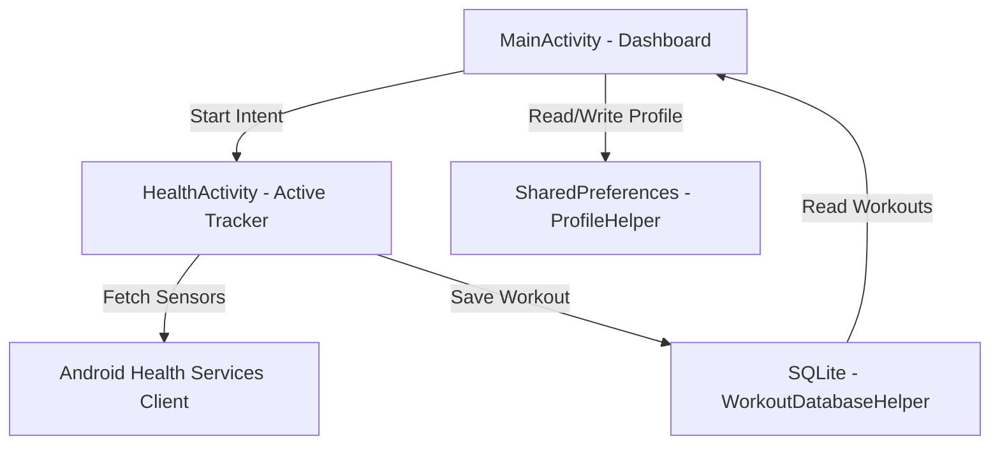

# 🏃‍♂️ Health Tracker - Android Fitness Companion

[](https://kotlinlang.org/)
[](https://developer.android.com)
[](https://developer.android.com/about/versions/marshmallow)
[]()
[]()

> A state-of-the-art Android Application designed to track, analyze, and display real-time physical activities (Heart Rate, Distance, Calories, Duration, and Pace). Built with modern glassmorphic dashboard analytics, local SQLite database persistence, and smart heart rate safety warnings.

---

## 🎨 Design Philosophy & UI Aesthetics

The application follows the **Material 3 Design Guidelines** with a focus on dark mode wellness aesthetics:
- **Deep Obsidian Surfaces (`#121212`)**: Reduces eye strain during night run workouts.
- **Sunset Crimson & Amber Gradients**: Energizes users and highlights active workout components.
- **Glassmorphic Cards**: Utilizes semi-transparent cards (`card_bg.xml`) with thin white strokes to provide depth and high premium quality.
- **Dynamic Heart Rate Pulse**: The heart rate icon animates dynamically matching the user's heartbeat speed.
- **Bilingual Interface**: Full support for both **English 🇺🇸** and **Vietnamese 🇻🇳**.

---

## ✨ Outstanding Features

| Feature | Description | Technical Stack |
| :--- | :--- | :--- |
| **📊 Glassmorphic Dashboard** | Live summary cards tracking weekly distance, calories burned, and active times. | `activity_main.xml`, `NestedScrollView` |
| **🏃‍♂️ Real-Time Tracker** | Launches active sessions monitoring distance, calories, duration, and average pace. | `HealthActivity.kt`, Health Services Client |
| **💓 HR Zone Determination** | Dynamically calculates training zones: **Warm Up**, **Fat Burn**, **Cardio**, and **Peak Zone**. | `ProfileHelper.kt` |
| **⚠️ Safety HR Alerts** | Emits vibration warning patterns and audio alerts when heart rate exceeds 95% of Max HR. | `ToneGenerator`, `Vibrator` |
| **🧪 Integrated BMI Calculator** | Computes Body Mass Index on-the-fly and indicates weight category immediately. | `ProfileHelper.kt` |
| **🗃 local SQLite Database** | Offline storage solution preserving workout session history. | `SQLiteOpenHelper`, `WorkoutDatabaseHelper` |
| **🔍 Search & Filter History** | Allows searching/filtering past workouts by distance or calorie thresholds. | `TextWatcher`, RecyclerView |

---

## 🏗 System Architecture



### 📂 File Structure Highlights

```
app/src/main/
├── AndroidManifest.xml (Activity mapping & Permission declarations)
├── java/com/example/healthmeasure/
│   ├── MainActivity.kt (Dashboard, Stats, Profile Management & History)
│   ├── HealthActivity.kt (Sensor Tracking, Audio/Haptic Alert, Save Logic)
│   ├── WorkoutSession.kt (Data model for single workout)
│   ├── WorkoutDatabaseHelper.kt (SQLite Open Helper Database layer)
│   ├── WorkoutAdapter.kt (RecyclerView binder for history cards)
│   └── ProfileHelper.kt (SharedPreferences & BMI/HR Zone calculator)
└── res/
    ├── anim/pulse.xml (Scaling animations for heart beat)
    ├── drawable/
    │   ├── card_bg.xml (Glassmorphic card container background)
    │   ├── card_bg_gradient.xml (Accent gradient banner background)
    │   ├── button_primary.xml (Energetic play action rounded ripple)
    │   ├── button_danger.xml (End/Stop action ripple)
    │   └── ic_*.xml (Premium vector graphics for fitness metrics)
    └── values/
        ├── colors.xml (Gradient and dark-themed color palettes)
        ├── strings.xml (English resources)
        └── themes.xml (Material 3 base light & dark styles)
```

---

## 🗃 Database Schema

Workouts are saved locally in `HealthTracker.db` inside the `workouts` table:

| Column | Type | Description |
| :--- | :--- | :--- |
| `id` | `INTEGER PRIMARY KEY AUTOINCREMENT` | Auto-generated ID. |
| `timestamp` | `INTEGER` | Epoch milliseconds when workout started. |
| `duration` | `INTEGER` | Total active session length in seconds. |
| `distance` | `REAL` | Total distance in kilometers (km). |
| `calories` | `INTEGER` | Total active calories burned (kcal). |
| `avg_heart_rate`| `INTEGER` | Calculated average Beats Per Minute (bpm). |
| `max_heart_rate`| `INTEGER` | Peak Beats Per Minute (bpm) detected. |

---

## 🚀 Setup & Execution Guide

### 📋 Prerequisites
1. **JDK 11 or 17** installed and configured in your environment path.
2. **Android SDK Platform 36** downloaded via Android Studio SDK Manager.

### 🛠 Compiling locally
Configure your local Android SDK location inside `local.properties`:
```properties
sdk.dir=/Users/your_username/Library/Android/sdk
```

Make Gradle executable and build the debug APK:
```bash
chmod +x gradlew
./gradlew assembleDebug
```

---

## 🔒 Permissions Requested

To guarantee exact tracking, the app prompts for standard fitness and location permissions:
- `android.permission.BODY_SENSORS`: To read live Beats Per Minute (BPM) from wrist/chest sensors.
- `android.permission.ACTIVITY_RECOGNITION`: To identify walking, running, and stationary steps.
- `android.permission.ACCESS_FINE_LOCATION`: To compute real-time track logs and GPS distance.
- `android.permission.VIBRATE`: Provides physical alerts during buttons press or emergency HR warnings.
